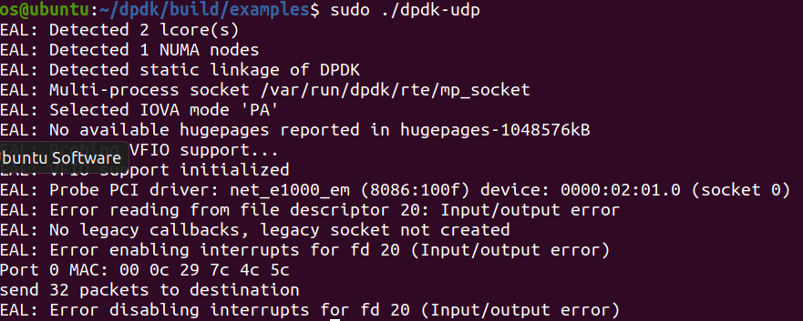
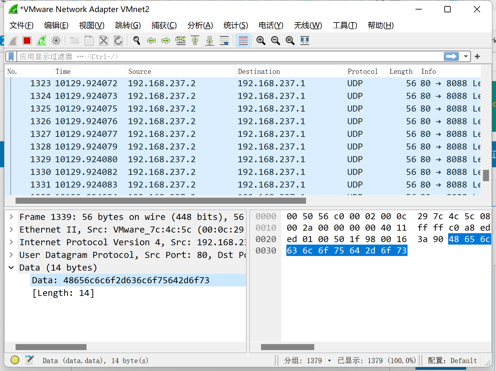

# lab2：dpdk

## 目录

-   [1、在DPDK中为什么使用Hugepage](#1在DPDK中为什么使用Hugepage)
-   [2、Take examples/helloworld as an example, describe the execution flow of DPDK  programs?](#2Take-exampleshelloworld-as-an-example-describe-the-execution-flow-of-DPDK--programs)
-   [3、Read the codes of examples/skeleton, describe DPDK APIs related to sending and receiving packets.](#3Read-the-codes-of-examplesskeleton-describe-DPDK-APIs-related-to-sending-and-receiving-packets)
-   [4、 Describe the data structure of 'rte\_mbuf'.](#4-Describe-the-data-structure-of-rte_mbuf)
-   [Part 2 : send packets with DPDK](#Part-2--send-packets-with-DPDK)

517021910011

董云鹏

### 1、在DPDK中为什么使用Hugepage

在DPDK中使用hugepage的目的是为了提高内存管理的效率和性能。DPDK的高性能网络应用程序需要大量的内存来存储和处理数据包，如果使用小页，会导致内存碎片和频繁的页面切换，进而影响性能。

### 2、Take examples/helloworld as an example, describe the execution flow of DPDK  programs?

1.  初始化环境: 通过调用`rte_eal_init()`函数进行初始化EAL。函数的参数是命令行参数argc和argv
2.  创建和启动Worker线程：使用RTE\_LCORE\_FOREACH\_WORKER()函数遍历所有Worker线程的ID，然后使用rte\_eal\_remote\_launch()函数将lcore\_hello()函数启动在相应的Worker线程上。lcore\_hello()函数是Worker线程的入口点，该函数在所有Worker线程上都被调用一次。
3.  调用lcore\_hello()函数：在主线程（Main core）上，调用lcore\_hello()函数。
4.  等待Worker线程结束：调用rte\_eal\_mp\_wait\_lcore()函数等待所有Worker线程结束。
5.  清理EAL：调用rte\_eal\_cleanup()函数清理EAL。程序结束

其中所有的数据包传输都由worker线程来完成

### 3、Read the codes of examples/skeleton, describe DPDK APIs related to sending and receiving packets.

-   rte\_eth\_rx\_burst():&#x20;
    从指定的以太网设备的接收队列获取数据包，循环遍历接收队列的Rx环形缓冲区，最多处理nb\_pkts个数据包。对于在环形缓冲区中已经完成的Rx描述符，它执行以下操作：
    -   根据NIC提供给该Rx描述符的信息初始化与Rx描述符关联的rte\_mbuf数据结构。
    -   将rte\_mbuf数据结构存储到rx\_pkts数组的下一个条目中。
    -   使用在初始化时与接收队列关联的内存池分配的新rte\_mbuf缓冲区来填充Rx描述符。
        当检索到由控制器分散到多个接收描述符中的输入数据包时，rte\_eth\_rx\_burst()函数将相关的rte\_mbuf缓冲区附加到数据包的第一个缓冲区。
    rte\_eth\_rx\_burst()函数返回从接收队列检索到的数据包的数量。参数port\_id是以太网设备的端口标识符。参数queue\_id指示要从中检索输入数据包的接收队列的索引。参数rx\_pkts表示一个指向rte\_mbuf结构体指针的数组的地址，该数组必须足够大以存储nb\_pkts个指针。参数nb\_pkts是要检索的最大数据包数。

```python
      /* Get burst of RX packets, from first port of pair. */
      struct rte_mbuf *bufs[BURST_SIZE];
      const uint16_t nb_rx = rte_eth_rx_burst(port, 0,
          bufs, BURST_SIZE);
```

-   rte\_eth\_tx\_burst(): 该API在main()函数中被调用，用于向网络接口传输数据包。它将数据包写入网络接口的传输队列中。该API需要传入以下参数：端口ID、队列ID、mbuf结构体数组以及要传输的数据包数量。
-   rte\_pktmbuf\_alloc():为存储传入和传出数据包的mbuf结构分配内存。该API接受以下参数：内存池指针和mbuf的大小
-   rte\_pktmbuf\_free(): 用于释放内存池中的 mbuf 结构体的函数。该函数会将 mbuf 和其关联的所有相关片全部释放，并将它们返回到原始的内存池中，以便下一次使用。函数参数m指示要释放的数据包mbuf。如果为NULL，则函数不执行任何操作。
-   rte\_eth\_dev\_configure(): 是DPDK中配置网卡设备的API。该API在main()函数中被调用，用于设置网络接口。它设置设备队列，初始化设备中断，设置设备速度和双工模式。该函数的参数如下：
    -   port\_id：端口ID，表示要配置的以太网设备。
    -   nb\_rx\_queue：RX队列的数量，即输入队列的数量。
    -   nb\_tx\_queue：TX队列的数量，即输出队列的数量。
    -   eth\_conf：以太网设备配置，包括链路速度、全双工/半双工模式等。
    -   pool：存储mbuf的内存池。该参数指定要用于mbuf的内存池，即在该内存池中分配mbuf所需的内存。
        在DPDK应用程序中，rte\_eth\_dev\_configure()函数通常在初始化阶段调用一次，以配置设备并分配资源。在配置阶段，可以设置网络设备的各种属性，包括队列数量、缓冲区大小、队列优先级、RSS配置等。该API也可以在运行时动态配置设备，例如增加或删除队列。
-   rte\_eal\_init(): 在main()函数中被调用以初始化DPDK环境。它设置必要的环境变量并初始化内存子系统。

### 4、 Describe the data structure of 'rte\_mbuf'.

'rte\_mbuf'是DPDK的缓冲buffer，用于在网络数据包接收和发送期间存储和操作数据包。

'rte\_mbuf'结构包括头部和数据缓冲区。头部包含关于数据包和缓冲区的元数据信息，而数据缓冲区包含实际的数据。

头部的元数据信息包括：

-   数据包长度（需要实际计算）
-   以太网头部：ether\_hdr，本实验中是14byte
-   VLAN头部（如果存在），本实验中没有涉及
-   IP头部:本实验中是20byte,包括服务类型，数据包id，目标地址，源地址，time\_to\_live等等
-   TCP/UDP头部（如果存在）
-   数据包的RSS散列值
-   数据包的时间戳
-   数据包的类型（例如，是接收还是发送）
-   数据包所在的物理端口：MAC

数据缓冲区包含了实际的数据，可能由一个或多个分片组成。每个分片包含一个指向缓冲区数据的指针，以及该分片的长度。

'rte\_mbuf'结构还包含一个指向下一个'mbuf'的指针，以及一个指向'mbuf'所属的内存池的指针。当使用完'mbuf'后，可以使用'rte\_pktmbuf\_free()'将其释放回内存池。

## Part 2 : send packets with DPDK

我采用的BURST\_SIZE与examples/skeleton相同都是32,，即一次发送32个数据包，每个数据包装填payload的大小为14byte,内容为“hello-cloud-os",

```python
  // Packet contain:
    //   Eth       |  IP         |  UDP      |  <payload>
  //    14byte       20byte       8byte
    struct rte_ether_hdr *eth_hdr = rte_pktmbuf_mtod(bufs[i], struct rte_ether_hdr *);
    struct rte_ipv4_hdr *ip_hdr = (struct rte_ipv4_hdr *)(rte_pktmbuf_mtod(bufs[i], char *) + size_eth_hdr);
    struct rte_udp_hdr *udp_hdr = (struct rte_udp_hdr *)(rte_pktmbuf_mtod(bufs[i], char *) + size_eth_hdr + sizeof(struct rte_ipv4_hdr));

    char *payload = (char *)(rte_pktmbuf_mtod(bufs[i], char *) + size_eth_hdr + sizeof(struct rte_ipv4_hdr) + size_udp_hdr);
    
    strcpy(payload, "Hello-cloud-os");
```



执行发送指令后可以看到数据包，destination\_address,source\_address与我们设计的相同，payload经过翻译也是相同的，同时各个包头的大小也与我们设计的相同




